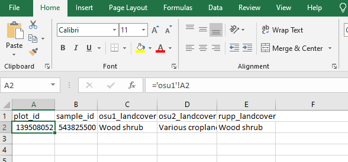

Workbook Setup
=============

Prerequisites:
--------------

* Completed CEO project with 2 or more interpreters/teams
* Excel or similar spreadsheet software

Part 1. Combine the sample data into a workbook
-------------------------------------------------

Now that we have the sample data from each team we need to combine them into a single worksheet to derive information about which interpreters disagree on samples. 

1. Create a new spreadsheet and name it "combined_CEO_project." Then rename the initial sheet to "compare"

2. Copy the samples from each team into separate sheets in the combined workbook

   1. Make sure to rename the sheet so you know which samples belong to which team

3. Add column names to the compare sheet

   1. Start with columns for: plot_id, sample_id, landcover_group1, landcover_group2

4. Fill in the values for plot_id 

   1. Select the first cell beneath plot_id
   2. type "=" 
   3. Navigate to the first plot_id in the first group and click it to select that value  and hit enter.
   
   You should see something similar to "='osu1'!A2"
   1. Repeat steps 1 - 3 for the remaining columns

5. Fill the columns
   
   1. Select the cells in the 2nd row
   2. Click, hold, and drag the fill handel until you've reached the end of your samples.
   
.. figure:: images/example_compare_2.png
   :alt: 
   :align: center   

Part 2. Identify disagreement
---------------------------------

We will need to create a formula to find which samples had disagreement between teams. When dealing with partially completed CEO sample files or more than two groups this can become tricky. 

1. Create a new column in the compare sheet and name it `disagreement`
2. Paste this Excel formula into the first cell 
3. Click, hold, and drag the fill handel until you've reached the end of your samples.

::

   =IF(COUNTIF(C2:E2,0)>0,OR(C2=D2,C2=E2,D2=E2),IF(OR(C2<>D2,C2<>E2,D2<>E2),FALSE,TRUE))

This formula handles two important situations: 

   1. If any of the sample data is incomplete. 
   2. Checks if all the samples agree or disagree.

The nested IF structure can be difficult to for us humans to read. In a more human readable format, the formula above says

If **condition 1**: Find the count of 0's (e.g. missing data) in the reference sample row(columns C2 to E2) 

   When condition 1 is *TRUE*, check that the sample references match. If they match return TRUE and if they don't return FALSE

   When condition 1 is *FALSE*, proceed to **condition 2**

If **condition 2**: Any combination of the references are not equal to each other. 

   When condition 2 is *TRUE*, return FALSE 

   When condition 2 is *FALSE*, return TRUE
   
::

      #condition 1
   =IF(COUNTIF(C2:E2,0)>0, #condition 1 true
                           OR(C2=D2,C2=E2,D2=E2), #condition 1 false
                                                  #condition 2 
                                                IF(OR(C2<>D2,C2<>E2,D2<>E2), #condition2 true, condition 2 false
                                                                              FALSE,            TRUE))
   #returns:                        TRUE/FALSE                                FALSE             TRUE

The result of the formula will return a TRUE value when all of the samples agree even if we are missing data for the sample from one of the teams, and will return FALSE if a team has a disagreement.

Part 3. Disagreement analysis
---------------------------------

Now we have all of our reference samples and a column to tell us if one of more disagrees we are ready to analyze the results.

1. Select all of the data in the combined spreadsheet.
2. Click `Insert` from the navigation bar and click `PivotTable`
3. Click `OK` in the Create PivotTable window that pops up

.. figure:: images/example_compare_3.png
   :alt: 
   :align: center   

4. Add each groups reference land cover field to the `Rows` area.
5. Add the `agreement` field to the `Filters` and `Values` area.
6. Navigate to the agreement filter located at the top of your pivot table and click the filter icon to
   1. Select `FALSE`
 
.. figure:: images/example_compare_4.png
   :alt: 
   :align: center   

The resulting pivot table now shows you which samples had disagreement and which land covers they were confused with. The labels are indented based on the order of your rows. 

